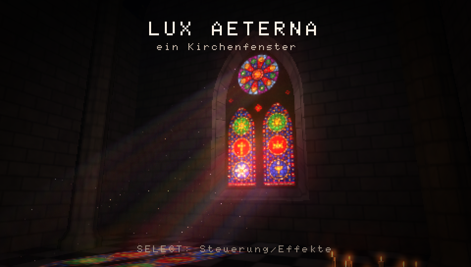
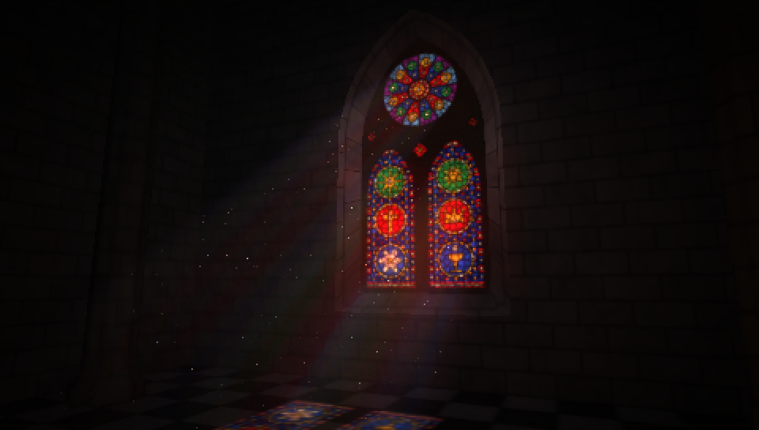
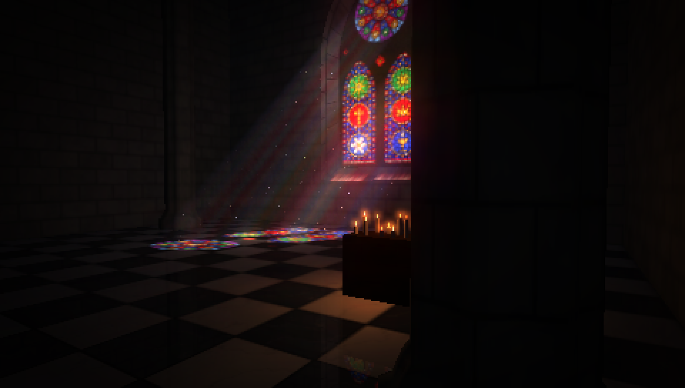

# psp-cathedral

*Lux Aeterna*: a Gothic stained-glass window for the PSP, with the sun
pouring through it into a dark nave.






The window is made when the program starts. Nothing is loaded from disk. It
has two lancets with medallions (rosette, cross, star, chalice, crown, sun) and
a twelve-petal rose above them, cut by tracery. The glass is split into pieces
by lead cames, and each piece has its own tint, streaks and the odd bubble. The
stone, the marble floor and the starry vault are procedural noise too. The sun
moves across the sky slowly and clouds pass in front of it.

## What the GE does

- **Light shafts**: 56 additive slices of the window, stepped along the
  sunlight.
- **Coloured light on the floor**: the glass is thrown onto the floor, piers and
  walls by the texture matrix (`GU_TEXTURE_MATRIX` + `GU_POSITION`), and lit by
  N·L.
- **Colour doubling** (`GU_FRAGMENT_2X`): lets glass and sunlight over-expose.
- **Bloom**: render-to-texture, a bright pass done with reverse-subtract
  blending, three downsampled levels with Kawase blur, and an additive
  composite.
- **Hardware lighting**: four lights (glow from the window, light bounced off
  the floor, flickering candles with specular, a cool fill), with attenuation.
- **Planar reflection** in the polished marble, drawn with a mirrored model
  matrix.
- **Bezier vault**: a hardware-tessellated Bezier patch.
- **Sprites**: dust motes as 3D sprites, each taking the colour of the shaft it
  drifts in; candle flames and halos.
- **Also**: vertex fog, mip-mapping, alpha test, a multiplicative vignette, and
  matrices through `libpspgum_vfpu`.

## Controls

| Button | |
|---|---|
| Analog stick | swing and raise the camera |
| D-pad | closer / further, look up / down |
| L / R | time of day |
| START | camera flight on / off |
| Triangle | bloom |
| Circle | light shafts |
| Square | dust |
| Cross | hold the sun |
| SELECT | help overlay |

## Build

```sh
docker run --rm -v "$PWD:/src" -w /src pspdev/pspdev:latest make
```

Copy `EBOOT.PBP` to `PSP/GAME/cathedral/` on the memory stick, or open it in
PPSSPP.

### Screenshots without a display

A build with `-DCAPTURE` renders a few preset views, writes each finished
frame to `host0:/shotN.bmp`, and exits:

```sh
docker run --rm -v "$PWD:/src" -w /src pspdev/pspdev:latest make EXTRA_CFLAGS=-DCAPTURE
PPSSPPHeadless "$PWD/cathedral.elf" -r "$PWD" --graphics=software
```

This has only been run in PPSSPP so far, not on real PSP hardware.
