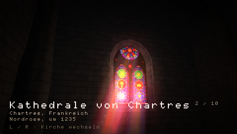
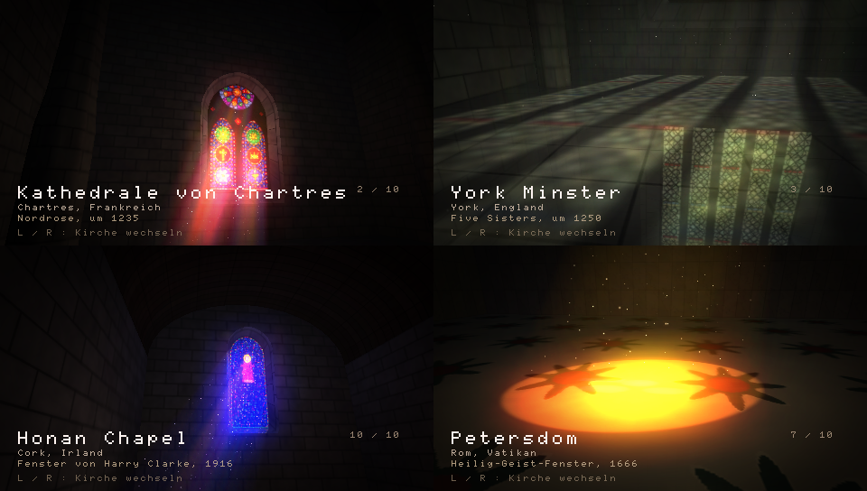

# psp-cathedral

*Lux Aeterna*: ten churches for the PSP, and the sun coming through their
glass. **L** and **R** walk from one to the next.





Nothing is loaded from disk. Each window is fired when you arrive: tracery,
lancets, roses, lead cames, per-piece tint, streaks and the odd bubble, all
described in code. The stone, the marble, the mosaic floors and the vaults are
noise. A camera then takes the room in, shot by shot, while the sun crosses the
sky and clouds pass in front of it. Bach plays underneath.

| | Church | Window |
|---|---|---|
| 1 | Sainte-Chapelle, Paris | three tall lights of medallions, after the glazing of 1248 |
| 2 | Chartres | lancets under a twelve-petal rose, after the north rose of c. 1235 |
| 3 | York Minster | five grisaille sisters in silver-green, after the window of c. 1250 |
| 4 | King's College, Cambridge | a perpendicular grid of figures under canopies, c. 1515 |
| 5 | Le Mans | a Romanesque round-headed light with one standing figure, c. 1120 |
| 6 | Santa Maria del Fiore, Florence | a Renaissance oculus, after the 1434 windows of the drum |
| 7 | St Peter's, Rome | alabaster and a dove in a glory of rays, after Bernini, 1666 |
| 8 | St Vitus, Prague | art nouveau bands around a warm centre, after the glass of 1931 |
| 9 | Franciscan church, Kraków | a vortex of violet and flame, after "Let there be!", 1904 |
| 10 | Honan Chapel, Cork | a narrow jewelled lancet, after Harry Clarke, 1916 |

Each window is this program's own drawing after a real one -- no photograph was
traced or used as pixels, and every original is long out of copyright. See
[CREDITS.md](CREDITS.md), which also carries the licence of the organ recording.

## What the GE does

- **Light shafts**: 56 additive slices of the window, stepped along the sunlight.
- **Coloured light on the floor**: the glass is thrown onto floor, piers and
  walls by the texture matrix (`GU_TEXTURE_MATRIX` + `GU_POSITION`), lit by N·L.
- **Colour doubling** (`GU_FRAGMENT_2X`): lets glass and sunlight over-expose.
- **Bloom**: render-to-texture, a bright pass by reverse-subtract blending,
  three downsampled levels with Kawase blur, additive composite.
- **Hardware lighting**: four lights (glow from the window, light bounced off
  the floor, flickering candles with specular, a cool fill), with attenuation.
- **Planar reflection** in the polished floor, drawn with a mirrored model matrix.
- **Bezier vault**: one hardware-tessellated patch, textured as ribs, a fan, a
  net, coffers, stars or planks, depending on the room.
- **Sprites**: dust motes as 3D sprites, each taking the colour of the shaft it
  drifts in; candle flames and halos.
- **Sound**: the Media Engine decodes the MP3; a thread of the program's own
  tops the decoder up and feeds the audio channel, running above the interface
  so that a heavy frame cannot starve it.
- **Also**: vertex fog, mip-mapping, alpha test, a multiplicative vignette, and
  matrices through `libpspgum_vfpu`.

Exposure is levelled per church: a pale wall of grisaille and a narrow jewelled
lancet differ by a factor of ten in what they let through, so the glass is
normalised to a mean brightness and what it casts into the room is normalised
again by the area of the opening.

## Controls

| Button | |
|---|---|
| L / R | previous / next church |
| Analog stick | take the camera yourself |
| D-pad up/down | closer / further |
| D-pad left/right | time of day |
| START | camera flight on / off |
| Triangle | bloom |
| Circle | light shafts |
| Square | dust |
| Cross | hold the sun |
| SELECT | help overlay |

## Build

```sh
docker run --rm -v "$PWD:/src" -w /src pspdev/pspdev:latest make
```

Copy `EBOOT.PBP` to `PSP/GAME/Cathedral/` on the memory stick, or open it in
PPSSPP. On a PSP running [PSPDX](https://github.com/chriopter/pspdx) it is in
the catalog under Demos.

A `v*` tag builds `dist/psp-cathedral.zip` (see `tools/package.sh`) and attaches
it to a GitHub release.

### Without a display

Three build flags render to files instead of to a screen, which is how the
pictures above and the catalog clip were made and how the sound was checked:

```sh
docker run --rm -v "$PWD:/src" -w /src pspdev/pspdev:latest make EXTRA_CFLAGS=-DCAPTURE
PPSSPPHeadless "$PWD/cathedral.elf" -r "$PWD" --graphics=software
```

- `-DCAPTURE` — one frame per church to `host0:/shotN.bmp`, plus the exposure
  numbers to `host0:/expo.txt`.
- `-DCAPTURE_VIDEO` — ten seconds of camera moves, 300 frames, to `host0:/vid/`
  (make the directory first).
- `-DCAPTURE_AUDIO` — starts the music, decodes for thirty seconds and writes what
  the MP3 decoder reported to `host0:/audio.txt`.

This has only been run in PPSSPP so far, not on real PSP hardware.
